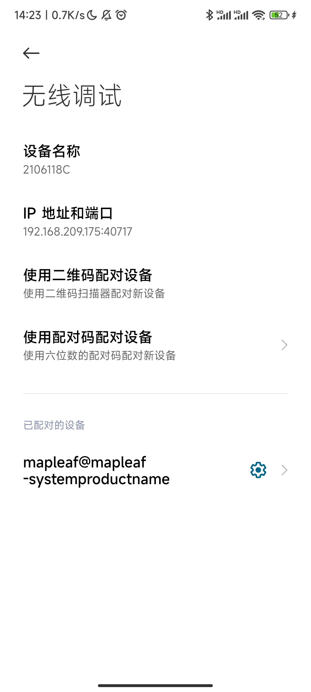

最近用adb进行调试时遇到了连不上的问题，之前的设备只需要执行`adb connect [ip:host]`就能直接连上，今天各种试都不行，查百度也不行。

于是我想可能是我的设备android版本是12的原因，最后google了下终于找到了[官方教程](https://developer.android.com/studio/command-line/adb)

总结一下官方连接教程如下:

## android 版本 11 及其以上

### 开启 wifi 调试

首先在 11 及以上版本中，开启 wifi 调试只需在设置的 **开发者选项** 里就能直接打开，在开发者选项里开启 **无线调试**

### 使用配对码配对设备

开启 wifi 调试后，这里在设备上点进 **无线调试** 如图:



点击 **使用配对码配对设备** ，这里会弹出配对码和配对的地址。使用如下命令进行授权配对

```bash
adb pair [ip:host]
```

这里回车后会让你输入配对码，看到 `Successfully paired` ，就是授权成功了

### adb wifi 连接

在完成上面的配对后，就可以直接进行连接了。连接的地址与端口，在无线调试页面有显示
```bash
adb connect [ip:host]
```

### 检查连接设备情况

```bash
adb devices -l
```
执行命令可以查看当前所有连接的设备，不出意外就可以看到咱们刚连接上的设备了


## android 版本 10 及其以下

### 开启 wifi 调试

这个版本没有系统的开启方法，官方给出的是先用USB连接adb执行以下命令
```bash
adb tcpip 5555
```

### adb wifi 连接

设备开启 wifi 调试后，之后就可以拔掉数据线，进行 wifi 调试了 *(系统重启后需要重新执行开启步骤)* ， wifi 调试连接命令如下:
```bash
adb connect [ip:host]
```
这里 ip 和 host 得是需连接设备的 ip 与端口号，端口号就是上个步骤指定的 `5555` 端口

### 检查连接设备情况

```bash
adb devices -l
```
执行命令可以查看当前所有连接的设备，不出意外就可以看到咱们刚连接上的设备了
