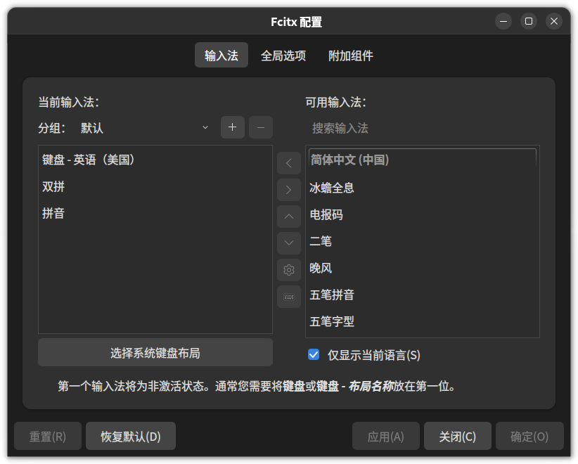
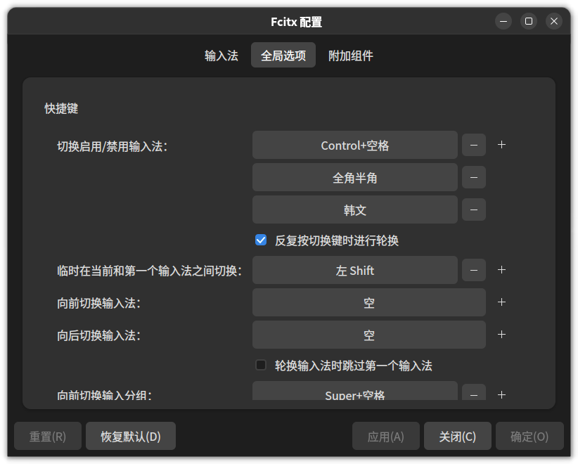
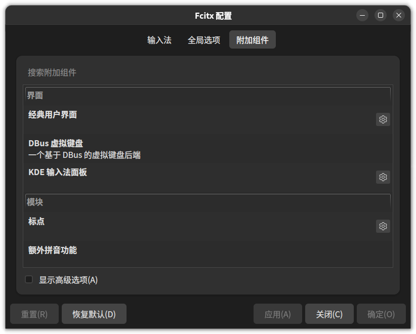
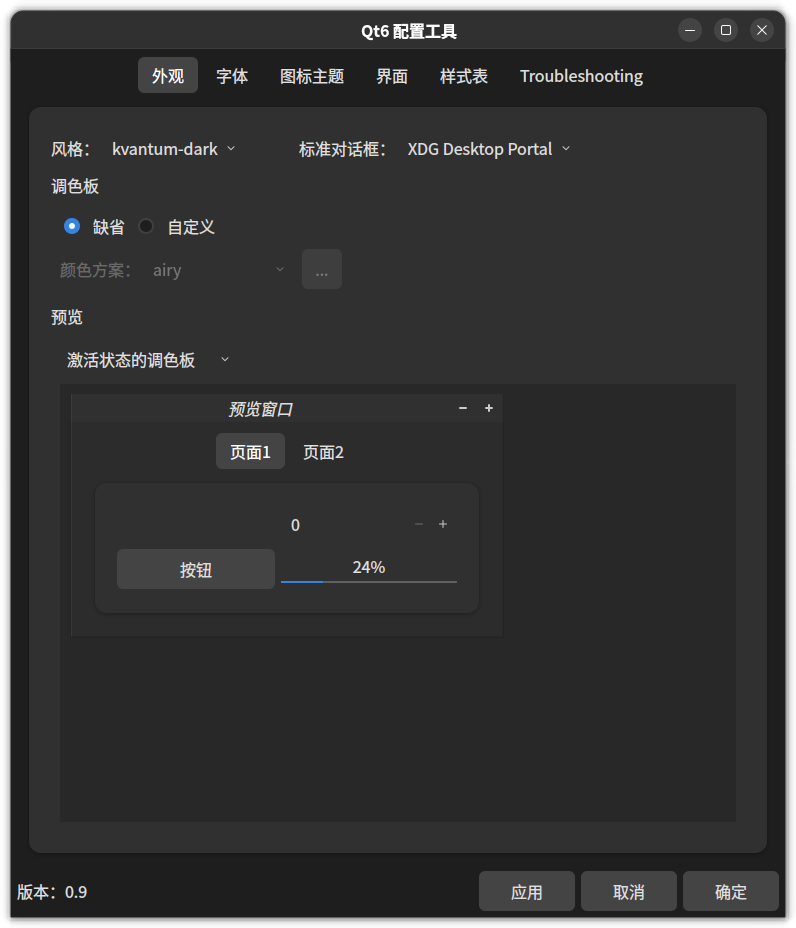
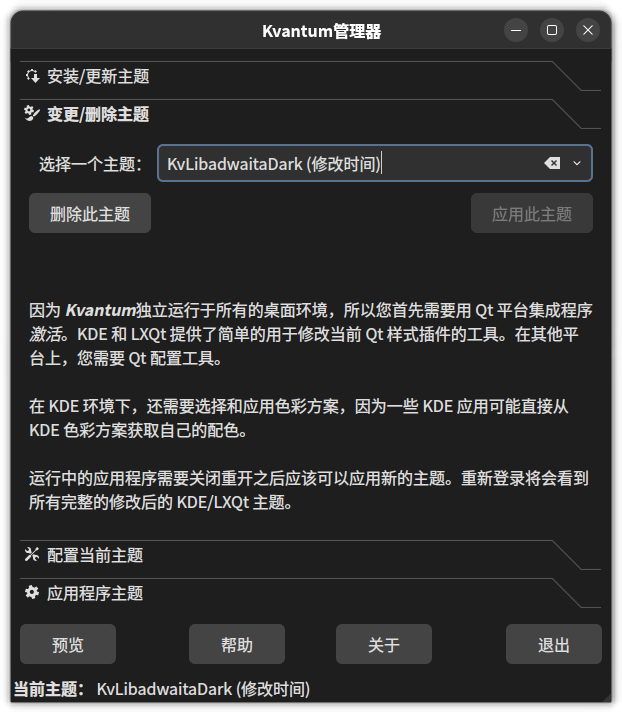
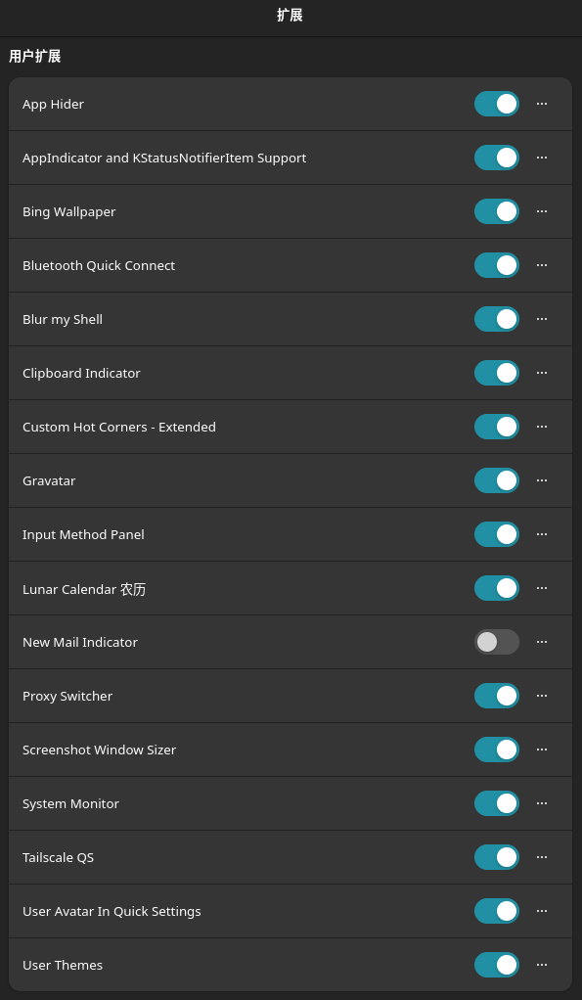

## 简介

普天同庆！微信终于发布 Linux 版本了！之前日常使用 Linux 环境，总是会使用一
时间就弃坑，还是生态问题无法与其他系统比。现在由于信创，各家大厂都在积极适配 Linux ，我又决定拿起来试试。

## 系统安装

~~在系统选择上，我的第一选择当然还是 Deepin ，算是国产之光了，现在已经是更新到 23 了~~

最终我选择了 EndeavourOS ，在 ArchLinux 基础上提供了更容易的安装方式，且在安装时就可以集成各种桌面环境的系统。它直接使用 ArchLinux 的官方库和 AUR 库，并且最关键的是 ArchLinux 的 wiki 完全适用 EndeavourOS ！

...省略安装步骤，安装很简单，根据提示直接下一步下一步就行，桌面环境选择 GNOME 就行（其实是没截图）

```bash
[mapleafgo@mapleafgo-pan ~]$ fastfetch
                     ./o.                   mapleafgo@mapleafgo-pan
                   ./sssso-                 -----------------------
                 `:osssssss+-               OS: EndeavourOS x86_64
               `:+sssssssssso/.             Kernel: Linux 6.12.1-arch1-1
             `-/ossssssssssssso/.           Uptime: 1 hour, 1 min
           `-/+sssssssssssssssso+:`         Packages: 1001 (pacman)
         `-:/+sssssssssssssssssso+/.        Shell: bash 5.2.37
       `.://osssssssssssssssssssso++-       Display (Microstep 24"): 1920x1080 @ 60 Hz in 24" [External]
      .://+ssssssssssssssssssssssso++:      DE: GNOME 47.2
    .:///ossssssssssssssssssssssssso++:     WM: Mutter (Wayland)
  `:////ssssssssssssssssssssssssssso+++.    WM Theme: HighContrastInverse
`-////+ssssssssssssssssssssssssssso++++-    Theme: KvLibadwaitaDark# [Qt], HighContrastInverse [GTK2/3/4]
 `..-+oosssssssssssssssssssssssso+++++/`    Icons: Fluent-dark [Qt], Fluent-dark [GTK2/3/4]
   ./++++++++++++++++++++++++++++++/:.      Font: Noto Sans CJK SC (12pt) [Qt], Noto Sans (10pt) [GTK2/3/4]
  `:::::::::::::::::::::::::------``        Cursor: Bibata-Modern-Ice (24px)
                                            Terminal: GNOME Console 47.1
                                            Terminal Font: Source Code Pro (10pt)
                                            CPU: 12th Gen Intel(R) Core(TM) i7-12700 (20) @ 4.90 GHz
                                            GPU: Intel AlderLake-S GT1 @ 1.50 GHz [Integrated]
                                            Memory: 6.13 GiB / 31.09 GiB (20%)
                                            Swap: 0 B / 8.00 GiB (0%)
                                            Disk (/): 25.83 GiB / 97.87 GiB (26%) - ext4
                                            Disk (/home): 26.45 GiB / 97.87 GiB (27%) - ext4
                                            Local IP (enp3s0): 192.168.1.*/23
                                            Locale: zh_CN.UTF-8
```

## 安装后

### neovim 编辑器

自带的 `nano` 用不习惯，直接先安装 `neovim`

```bash
yay -S neovim
```

安装后你会发现，neovim 内的复制，只能在当前会话中，无法复制粘贴到其他地方，这个时候就需要安装另一个包 `wl-clipboard` ，wayland 下命令行的复制粘贴支持

```bash
yay -S wl-clipboard
```

当然，这还没完，你还需要开启 neovim 的剪切板功能。将 `set clipboard=unnamedplus` 写入 `/etc/xdg/nvim/sysinit.vim` 文件新一行，这样才能全局开启
(我还在 `/etc/xdg/nvim/sysinit.vim` 加了个显示行号的配置 `set number`)

然后在全局变量中配置 nvim 为默认编辑器，编辑 `/etc/environment` 文件，将 EDITOR 环境变量改为 nvim 。改前 `EDITOR=nano` 改后 `EDITOR=nvim`

这样就可以了

### fcitx5 输入法

之前用 ibus ， fcitx 更新 5 后，就一直安装 fcitx5 了。在 ArchLinux 系的系统安装，只需要安装 `fcitx5-im` 和 中文组件 `fcitx5-chinese-addons` ，非常方便， `fcitx5-im` 直接把 fcitx5 必要的都安装好了

1. 安装包命令：

    ```bash
    yay -S fcitx5-im fcitx5-chinese-addons
    ```

2. 配置环境变量：

    将下面三个环境变量写入 `/etc/environment` 文件，这样便全局可用了

    ```bash
    XMODIFIERS=@im=fcitx
    GTK_IM_MODULE=fcitx
    QT_IM_MODULE=fcitx
    ```

3. GNOME 扩展安装：

    安装上 [Input Method Panel](https://extensions.gnome.org/extension/261/kimpanel/) 才能在 GNOME 顶栏上看到当前的输入状态

到这里，中文输入法的问题解决了

### QT 样式

在 GNOME 下 QT 默认样式特别丑，就拿 fcitx5 的配置应用来说，就丑哭了那种，一度让我想放弃它。直到我看到了这篇文章 [Uniform look for Qt and GTK applications](https://wiki.archlinux.org/title/Uniform_look_for_Qt_and_GTK_applications)

按这篇文章里讲的这些方案，我挨个试下来，最终得到如下的效果







是不是跟 gnome shell 应用一模一样，下面咱们一步一步来

1. 安装包命令：

    ```bash
    yay -S qadwaitadecorations-qt5 qadwaitadecorations-qt6 qt6ct kvantum kvantum-theme-libadwaita-git
    ```

2. 配置环境变量：

    将下面环境变量写入 `~/.bash_profile` 文件中

    ```bash
    # QT Style
    export QT_WAYLAND_DECORATION=adwaita
    export QT_QPA_PLATFORM="wayland;xcb"
    export QT_QPA_PLATFORMTHEME=qt6ct
    ```

3. 配置 Qt6设置 风格

    打开 **Qt6设置** 工具，配置风格为 **kvantum-dark** (因为我使用的暗色，所以选 **kvantum-dark** ，你也可以选 **kvantum**)，再在图标主题中选择一个图标库。其他可以不用动

    

4. 配置 Kvantum Manager

    打开 **Kvantum Manager** ，点击 **变更/删除主题**，在 *选择一个主题* 中选择 **KvLibadwaitaDark** (这里也是由于我主色调为暗色，你也可以选择 **KvLibadwaita** ，根据自己情况选择)，最后点击应用此主题，就算配置完成了

    

    > 这里配置完你会发现焦点处有个框，非常影响美观，这个可以在 Kvantum Manager 配置。只须在 **配置当前主题** > **杂项** > **删除焦点矩形** 勾选上这个复选框即可

5. 统一鼠标样式

    其实安装好包后细心的你应该就发现了，鼠标进入 qt 应用时，样式发生了改变，与系统不统一。其实只需要将下面的环境变量写入 `~/.bash_profile` 即可解决

    ```bash
    # 统一鼠标样式
    export XCURSOR_THEME=$(gsettings get org.gnome.desktop.interface cursor-theme | tr -d "'")
    export XCURSOR_SIZE=$(gsettings get org.gnome.desktop.interface cursor-size)

    ```

    这会统一整个系统的鼠标样式及其大小

6. 关于 QT5 应用

    QT5 应用现在还是比较少了，那些包安装又麻烦，我就懒得折腾了。

    但是有些是依赖系统 `python-pyqt5` 展示的应用，但它们内部其实是做了兼容处理，优先使用 `python-pyqt6`。所以我们可以安装个 `python-pyqt6`

    ```bash
    yay -S python-pyqt6
    ```

到这里，你的 QT 应用应该就与系统统一了

### Gnome 好玩儿的扩展

首先上一张我当前安装的所有扩展的列表



1. [App Hider](https://extensions.gnome.org/extension/5895/app-hider/) *

    用来隐藏应用图标的，可以让应用图标不展示在应用列表里

2. [AppIndicator and KStatusNotifierItem Support](https://extensions.gnome.org/extension/615/appindicator-support/) *

    这个可以算是现在 GNOME 必须的，应用托盘图标

3. [Bing Wallpaper](https://extensions.gnome.org/extension/1262/bing-wallpaper-changer/)

    自动切换Bing壁纸，不一样的壁纸，不一样的心情

4. [Bluetooth Quick Connect](https://extensions.gnome.org/extension/1401/bluetooth-quick-connect/)

    在顶栏中快速方便的连接蓝牙设备

5. [Blur my Shell](https://extensions.gnome.org/extension/3193/blur-my-shell/)

    给整个 GNOME 环境加上模糊效果，视觉更上一层楼。顶栏、应用等的模糊效果都能设置

6. [Clipboard Indicator](https://extensions.gnome.org/extension/779/clipboard-indicator/) *

    剪切板，这个算是现在系统不可或缺的功能吧。可以查看并使用历史复制的

7. [CHC-E (Custom Hot Corners - Extended)](https://extensions.gnome.org/extension/4167/custom-hot-corners-extended/) *

    自定义热区，让屏幕的每个角都带上不一样的快捷功能

8. [Gravatar](https://extensions.gnome.org/extension/6922/gravatar/)

    让系统用户头像使用 Gravatar 的头像

9. [Input Method Panel](https://extensions.gnome.org/extension/261/kimpanel/) *

    顶栏输入状态展示，这个前面输入法的时候说过，算是系统必装的

10. [Lunar Calendar 农历](https://extensions.gnome.org/extension/675/lunar-calendar/)

    在顶栏的日历中展示中国农历时辰，**这个扩展不是装上就能用的，需要根据说明执行脚本才行**

11. [Proxy Switcher](https://extensions.gnome.org/extension/771/proxy-switcher/) *

    在顶部操作面板中，快捷的切换代理模式

12. [System Monitor](https://extensions.gnome.org/extension/6807/system-monitor/)

    在顶栏中监控系统状态，CPU占用，内存占用，交换空间占用，上下网速等

13. [Tailscale QS](https://extensions.gnome.org/extension/6139/tailscale-qs/)

    在顶栏操作面板中，快捷的控制 Tailscale

14. [User Avatar In Quick Settings](https://extensions.gnome.org/extension/5506/user-avatar-in-quick-settings/)

    在顶栏操作面板中展示用户头像

15. [User Themes](https://extensions.gnome.org/extension/19/user-themes/) *

    配置主题时，让其可以加载用户目录的主题，在安装来自 [pling](https://www.pling.com/) 的主题时非常有用

### 图标库推荐

推荐在 [pling](https://www.pling.com/) 安装主题和图标库

最好在安装 `ocs-url` 包后，在 pling 安装主题将自动安装到用户目录，配合 [User Themes](https://extensions.gnome.org/extension/19/user-themes/) 扩展，可以直接在 **Gnome Tweaks** 中进行应用。非常方便

```bash
yay -S ocs-url
```

推荐图标库 [Fluent icon theme](https://www.pling.com/p/1477945)

### 鼠标样式推荐

推荐 [Bibata Cursor](https://github.com/ful1e5/Bibata_Cursor) ，6套颜色可选，使用如下命令安装

```bash
yay -S bibata-cursor-theme-bin
```

安装后，在 **Gnome Tweaks** 中进行应用

## 重要说明 *

**在上面美化过程中，配置环境变量后，都需要重启才能应用上。可以用命令 `env` 查看当前系统环境变量**

## 常用 yay 命令

最后补充几个常用的 yay 命令，基本这几个就够用了

```bash
# 搜索安装
yay {包名}

# 直接安装已知全名的包
yay -S {包名}

# 级联卸载
yay -Rns {包名}

# 清理无用的包
yay -Ycc

# 清理安装缓存
yay -Scc

# 检查更新
yay -Syu
```
