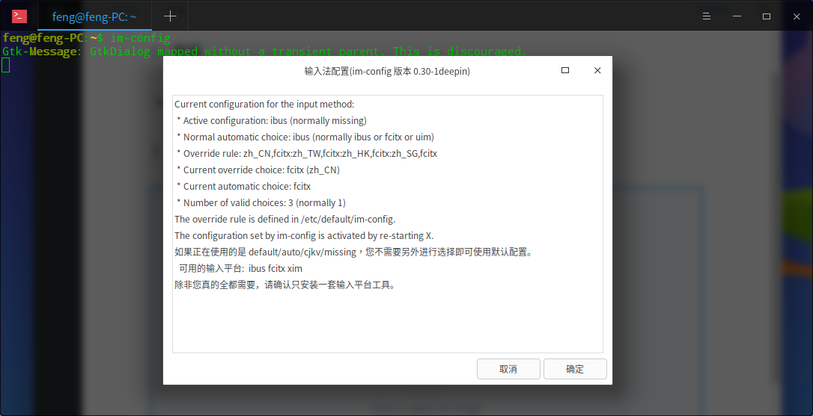
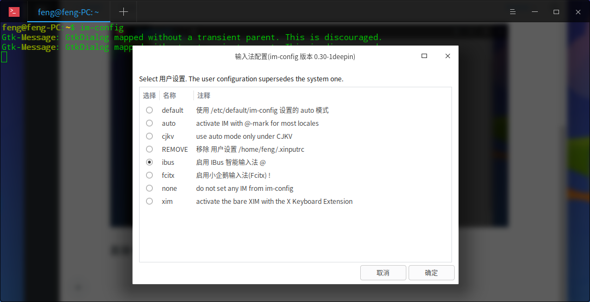

### 1、安装

`sudo apt install -y ibus ibus-gtk ibus-gtk3 ibus-qt4`

### 2、使用 im-config 切换输入法引擎

直接一路确定、yes

到这一步选择 ibus，再一路确定。就搞定了

### 常见问题：

旧版本 im-config 因为存在两个 ibus 配置文件，所以 ibus 读取不到。可到`/usr/share/im-config/data/`目录下删除 23_ibus 的两个文件。再次启动 im-config 就可以了
